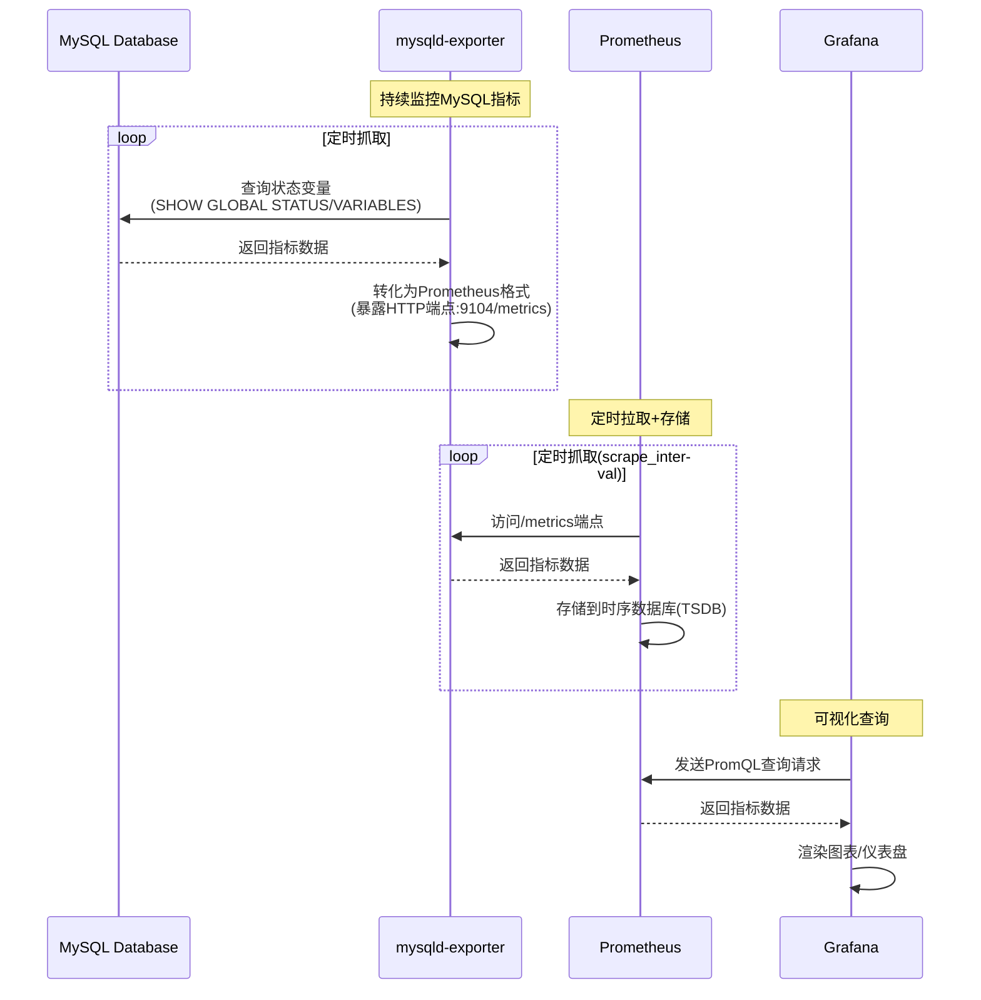

1. Prometheus、Grafana 和 mysqld-exporter 协同工作的流程图及文字说明：



1.1 极简流程图

```angular2html
+------------------+
|     MySQL        |  ← 通过SQL查询监控指标
+------------------+
        ↓
+------------------+
| mysqld-exporter  |  ← 暴露 /metrics (端口:9104)
+------------------+
        ↓
+------------------+
|   Prometheus     |  ← 定时拉取 + 存储 (TSDB)
+------------------+
        ↓
+------------------+
|    Grafana       |  ← 可视化 (PromQL查询)
+------------------+
```
